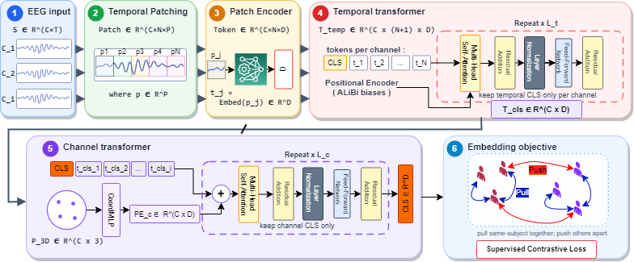

# NeuroShield

NeuroShield is a channel-flexible, temporal-flexible foundation model for EEG authentication. The model maps variable-channel EEG windows into a shared subject-discriminative embedding space and supports:

- pretrained zero-shot transfer,
- downstream fine-tuning,
- variable channel layouts with missing-channel masks,
- variable temporal window lengths.

This repository accompanies the paper:

*NeuroShield: A Device-Agnostic Foundation Model for EEG Authentication*

If you use this code or the released checkpoint in academic work, please cite the paper:

```bibtex
@misc{fallahi2026neuroshield,
  title        = {NeuroShield: A Device-Agnostic Foundation Model for EEG Authentication},
  author       = {Fallahi, Matin and Arias-Cabarcos, Patricia and Strufe, Thorsten},
  year         = {2026},
  note         = {Manuscript and software release},
  howpublished = {\url{https://github.com/kit-ps/NeuroShield-FM}}
}
```

This repository contains the essential components for training, adapting, and running NeuroShield:

- model architecture and training code,
- hyperparameter search and best-trial replication,
- downstream fine-tuning code,
- a minimal pretrained-checkpoint inference example,
- the foundation checkpoint and its metadata.

## Model Architecture

NeuroShield uses a dual-stage transformer design:

1. A temporal transformer summarizes each EEG channel independently from patch tokens.
2. A channel transformer aggregates per-channel summaries with geometry-aware 3D electrode-position embeddings.

The included foundation checkpoint uses:

- `embedder = mlp_patch`
- `embed_dim = 128`
- `num_heads = 8`
- `channel_depth = 6`
- `temporal_depth = 4`
- `patch_len = 50`

Architecture figure:



## Checkpoint Placement

The pretrained foundation checkpoint is expected at:

```text
ckpts_bw_replicate_varlen/
  replicate_best_trial_varlen_final.pth
  replicate_best_trial_varlen_meta.json
```

This repository already includes the foundation checkpoint and metadata in this folder, so the example scripts work without an extra download step.

## Installation

Create a Python environment and install the repository requirements:

```bash
python -m venv .venv
.venv\Scripts\activate
pip install -r requirements.txt
```

## Most Important Preprocessing Assumptions

NeuroShield does not expect raw EDF/BDF files directly. The main training and evaluation pipeline works from packed EEG segments and associated layout metadata.

For reproducible inference, keep these assumptions aligned with the training pipeline:

- EEG is segmented into fixed windows before inference.
- The common downstream setting in this repo uses `500` samples per window, corresponding to `1 s` at `500 Hz`.
- Channels are normalized to canonical EEG labels before reordering.
- Input channels can vary by sample, but channel order must match across `X`, `M`, and `P`.
- Missing or unavailable channels are indicated by a boolean mask rather than by forcing a fixed headset layout.
- Each channel needs a 3D electrode position so the geometry-aware channel encoder can apply its positional model.
- The included foundation checkpoint uses `chan_norm = none`, so do not apply an extra hidden channel-wise normalization step unless you are intentionally changing the protocol.

If you want behavior close to the paper results, follow the packed-data path used in this repo rather than introducing a separate preprocessing stack.

## Minimal Inference Inputs

The simplest direct model input is a NumPy bundle containing:

- `X`: EEG windows with shape `[N, C, T]`, dtype `float32`
- `M`: channel-validity mask with shape `[N, C]`, dtype `bool`
- `P`: channel 3D positions with shape `[N, C, 3]`, dtype `float32`

Where:

- `N` = number of windows
- `C` = number of channel slots in this batch
- `T` = samples per window

Important:

- `X[i, j]`, `M[i, j]`, and `P[i, j]` must refer to the same channel slot.
- Invalid channels should have `M=False`.
- Channel order does not need to be the same as a fixed global headset layout, but the positions must correspond to the actual channels present.

The model produces `128`-dimensional embeddings.

## Minimal Inference Example

See:

- [examples/minimal_inference.py](examples/minimal_inference.py)

Example:

```bash
python examples/minimal_inference.py --input-npz sample_batch.npz --output-npy sample_embeddings.npy
```

The `.npz` file should contain:

- `X`
- `M`
- `P`

The script loads the pretrained checkpoint from `ckpts_bw_replicate_varlen/` and writes one embedding per input window.

## Training and HPO

Main scripts:

- `eeg_auth_train_optuna.py`
  End-to-end training pipeline with Optuna-based hyperparameter search.

- `eeg_auth_replicate_best_varlen.py`
  Reloads the best Optuna trial and retrains it to produce the foundation checkpoint.

- `eeg_auth_finetune.py`
  Fine-tunes the pretrained foundation checkpoint on a downstream target dataset.

- `evaluate_channel_level_experiments.py`
  Channel-level analyses for both fine-tuned and zero-shot checkpoints.

## Included Files

This repository includes:

- `eeg_auth_train_optuna.py`
- `eeg_auth_replicate_best_varlen.py`
- `eeg_auth_finetune.py`
- `evaluate_channel_level_experiments.py`
- `utils_evaluation.py`
- `examples/minimal_inference.py`
- `examples/score_authentication.py`
- `figures/brainwave_auth_architecture_paper.svg`
- `ckpts_bw_replicate_varlen/replicate_best_trial_varlen_final.pth`
- `ckpts_bw_replicate_varlen/replicate_best_trial_varlen_meta.json`
